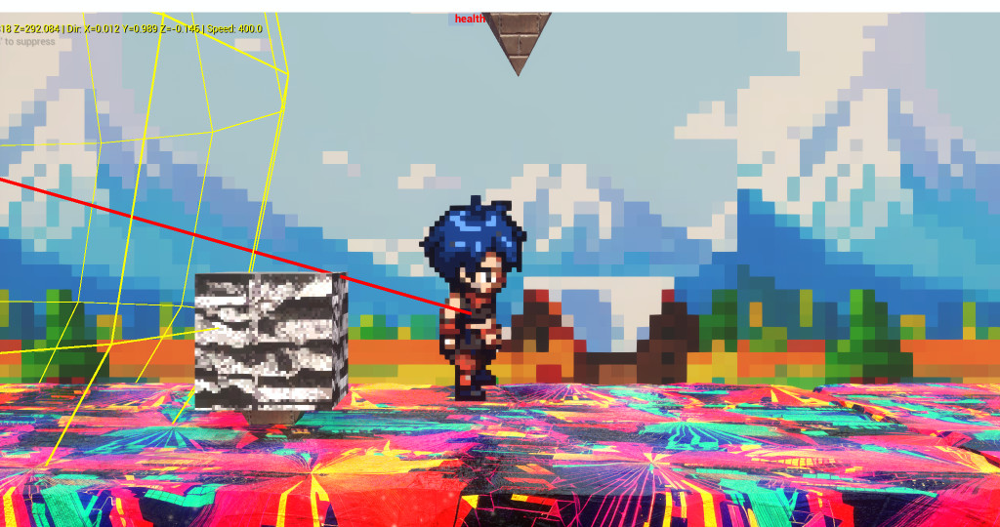

# ChromaRunner

This is a 2.5D side-scrolling platformer game named ChromaRunner, built with Unreal Engine 5. The project is written in C++ and uses Unreal Engine's build system. The core gameplay revolves around a player character, `RunnerCharacter`, who can run, jump, and double jump through levels. The game features a state machine for character animations, collision detection with obstacles, and a level restart mechanism.

## Key Technologies

*   **Engine:** Unreal Engine 5
*   **Language:** C++ (C++20 standard)

## Building and Running

### Building

To build the project, you will need to have Unreal Engine 5 installed. You can then generate project files for your IDE (e.g., Visual Studio, Rider) and build the project from there.

### Running

The project can be run from the Unreal Editor by opening the `SideRunner.uproject` file and clicking the "Play" button. Alternatively, you can build the project and run the standalone executable.
