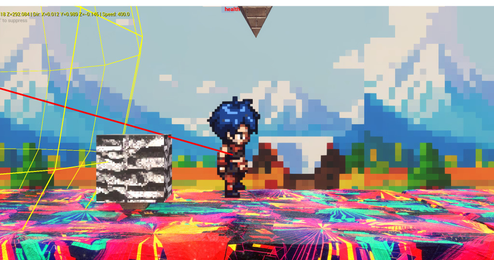

# ChromaRunner 🏃‍♀️



**A high-skill 2.5D endless runner platformer built with Unreal Engine 5.5**

[](LICENSE)
[](https://www.unrealengine.com/)
[](https://isocpp.org/)
[](CONTRIBUTING.md)

---

## 🎮 About

ChromaRunner is an **open-source** skill-based platformer where precision, timing, and split-second reactions determine survival. Sprint through procedurally generated levels, dodge deadly obstacles, collect coins, and compete for global high scores.

**Key Features:**
- ✅ Procedural level generation with 5+ biomes
- ✅ Tight platforming controls (run, jump, double-jump)
- ✅ Lives system with game over flow
- ✅ Health bar and damage system
- ✅ Coin collection and scoring
- ✅ Steam achievements and leaderboards *(Steam version)*
- ✅ Full C++ source code available for learning

---

## 🎓 Project Origins

ChromaRunner started as a learning project following the excellent [**Endless Runner tutorial by AwesomeTuts**](https://awesometuts.com/blog/unreal-engine-cpp-tutorial-endless-runner-game/). Over 12+ months of development, the codebase was **completely rewritten and expanded** with:

- Custom health system with PlayerHealthComponent
- Lives management via SideRunnerGameInstance
- UMG C++ widget system (HUD, Game Over screens)
- Procedural level generation with BaseLevel system
- Coin collection and scoring mechanics
- Game mode orchestration with ASideRunnerGameMode
- Console debug commands for rapid testing

**What remains from the tutorial:** The core "endless runner" concept and initial character movement foundation.

**What's custom:** 95% of the codebase, all systems architecture, UMG integration, game flow, and procedural generation.

**Credit:** Special thanks to [AwesomeTuts](https://awesometuts.com/) for the foundational tutorial that made this project possible.

---

## 🚀 Quick Start

### Prerequisites

- **Unreal Engine 5.5** ([Download here](https://www.unrealengine.com/download))
- **Visual Studio 2022** (Windows) or **Clang 15+** (Linux/Mac)
- **Git** for cloning the repository
- **8GB+ RAM** (16GB recommended)

### Clone and Build

```bash
# Clone the repository
git clone https://github.com/[YOUR_GITHUB_USERNAME]/ChromaRunner.git
cd ChromaRunner

# Option 1: Build via Makefile (Linux/Mac)
make SideRunnerEditor

# Option 2: Build via Visual Studio (Windows)
# 1. Right-click SideRunner.uproject → "Generate Visual Studio project files"
# 2. Open ChromaRunner.sln in Visual Studio 2022
# 3. Build Solution (Ctrl+Shift+B)

# Option 3: Build via Unreal Editor
# 1. Double-click SideRunner.uproject
# 2. Unreal Editor will auto-compile C++ on first launch (may take 5-10 minutes)
```

### Run the Game

```bash
# From Unreal Editor
# Click "Play" (Alt+P) in the editor toolbar

# Standalone build (after compilation)
./Binaries/Linux/SideRunner
# or on Windows:
Binaries\Win64\SideRunner.exe
```

---

## 🎯 How to Play

**Controls:**
- **Spacebar / W**: Jump (press twice for double-jump)
- **A / D**: Move left/right *(limited horizontal movement)*
- **ESC**: Pause menu
- **`** *(tilde)*: Debug console *(development builds only)*

**Objective:** Survive as long as possible, collect coins, reach 5,000 meters to win!

**Lives System:** You start with 3 lives. Each death costs 1 life. Lose all 3 lives = Game Over.

**Obstacles:**
- 🔪 **Spikes**: Instant damage (15 HP)
- 🧱 **Walls**: Block your path
- 👾 **Enemies**: Moving hazards *(coming soon)*

**Debug Commands** *(Development builds only)*:
```
TeleportToDistance 5000    # Teleport to 5000m (test win condition)
KillPlayer                  # Instant death (test lives system)
stat fps                    # Show FPS counter
```

---

## 📂 Project Structure

```
ChromaRunner/
├── Source/
│   └── SideRunner/
│       ├── RunnerCharacter.h/cpp        # Player character with movement
│       ├── PlayerHealthComponent.h/cpp  # Health and damage system
│       ├── SideRunnerGameInstance.h/cpp # Game state (lives, score)
│       ├── SideRunnerGameMode.h/cpp     # Game flow orchestration
│       ├── GameHUDWidget.h/cpp          # In-game HUD base class
│       ├── GameOverWidget.h/cpp         # Game over screen base class
│       ├── BaseLevel.h/cpp              # Procedural level generation
│       ├── CoinPickup.h/cpp             # Coin collectibles
│       └── Obstacle.h/cpp               # Base obstacle class
├── Content/
│   ├── SideRunner/
│   │   ├── Blueprints/                  # BP_RunnerCharacter, WBP_GameHUD
│   │   ├── Materials/                   # Visual materials
│   │   └── Framework/                   # BP_SideRunnerGameMode
│   ├── Art/                             # Character sprites, backgrounds
│   ├── Audio/                           # Music and SFX
│   └── Maps/                            # Level_1.umap, TheGame.umap
├── Config/                              # DefaultEngine.ini, DefaultInput.ini
├── Plugins/                             # PaperZD (2D animation)
└── Documentation/
    ├── Game_Over_UMG_System_Plan.md     # Phase 4 implementation guide
    ├── Blueprint_UMG_Setup_Guide.md     # Widget creation guide
    ├── Testing_Guide.md                 # Comprehensive testing procedures
    └── Monetization_Strategy_OpenSource.md  # Business strategy
```

---

## 🛠️ Core Systems

### 1. Character Movement (`RunnerCharacter`)
- State machine: Idle, Running, Jumping, Falling, DoubleJumping, Dead
- Double-jump mechanic with coyote time
- Side-scrolling movement with limited horizontal control

### 2. Health System (`PlayerHealthComponent`)
- 100 HP maximum health
- Damage types: Spikes, EnemyMelee, Projectile, Environmental
- Invulnerability frames (1 second after damage)
- Death handling with lives integration

### 3. Lives System (`SideRunnerGameInstance`)
- 3 lives per game session
- Death → Respawn with remaining lives
- 0 lives → Game Over screen
- High score persistence across sessions

### 4. Game Flow (`SideRunnerGameMode`)
- Widget lifecycle management (HUD, Game Over screens)
- Delegate-driven architecture (OnGameWon, OnGameLost events)
- Input mode switching (gameplay ↔ UI)
- Prevents duplicate game over screens

### 5. UI System (UMG C++)
- **GameHUDWidget**: Lives, distance, score display
- **GameOverWidget**: Win/loss screens with restart functionality
- Event-driven updates (no Tick overhead for performance)

### 6. Procedural Levels (`BaseLevel`)
- Trigger-based segment spawning
- Difficulty scaling over distance
- Object pooling for performance
- Activatable/deactivatable segments

---

## 🎨 Development Roadmap

### ✅ Phase 1: Character Movement (Complete)
- Double-jump platforming
- Animation state machine
- Collision detection

### ✅ Phase 2: Health System (Complete)
- PlayerHealthComponent
- Damage types and invulnerability
- Health bar widget

### ✅ Phase 3: Lives System (Complete)
- SideRunnerGameInstance
- Lives counter HUD
- Respawn on death

### ✅ Phase 4: Game Flow UI (Complete)
- Game Over screens (win/loss)
- GameMode integration
- Restart functionality

### 🚧 Phase 5: Polish & Content (In Progress)
- [ ] 5+ unique biomes (Forest, Desert, Underwater, Space, Lava)
- [ ] 20+ obstacle variations
- [ ] Enemy AI system
- [ ] Power-ups (shield, magnet, speed boost)
- [ ] Particle effects and visual polish

### 📋 Phase 6: Community Features (Planned)
- [ ] Steam achievements (50+ achievements)
- [ ] Global leaderboards
- [ ] Daily challenge mode
- [ ] Speedrun timer mode
- [ ] Workshop mod support

---

## 💰 Support the Project

ChromaRunner is **free and open source**, but if you enjoy the game and want to support development:

### Option 1: GitHub Sponsors
Monthly support helps fund:
- New content updates
- Bug fixes and optimization
- Future game projects

[💖 Become a Sponsor](https://github.com/sponsors/[YourUsername])

### Option 2: Steam (Coming Soon)
Buy the convenience edition with:
- ✅ One-click install (no compilation)
- ✅ Auto-updates
- ✅ Steam achievements
- ✅ Cloud saves
- ✅ Global leaderboards

[🎮 Wishlist on Steam](https://store.steampowered.com/app/[AppID])

### Option 3: itch.io (Pay-What-You-Want)
Download compiled binaries, pay what feels right ($0-$10).

[🎁 Get on itch.io](https://[username].itch.io/chromarunner)

---

## 🤝 Contributing

Contributions are welcome! Whether you're fixing bugs, adding features, or improving documentation, every bit helps.

**Quick Start for Contributors:**
1. Fork this repository
2. Create a feature branch: `git checkout -b feature/my-new-feature`
3. Make your changes and commit: `git commit -m 'feat: add awesome feature'`
4. Push to your fork: `git push origin feature/my-new-feature`
5. Open a Pull Request

**Good First Issues:** Check the [Issues tab](https://github.com/[YourUsername]/ChromaRunner/issues?q=is%3Aissue+is%3Aopen+label%3A%22good+first+issue%22) for beginner-friendly tasks.

**Code Style:** Follow Unreal Engine coding standards (see [CONTRIBUTING.md](CONTRIBUTING.md))

**Areas Needing Help:**
- 🎨 **Art**: New obstacle sprites, background tiles, character skins
- 🎵 **Audio**: Background music tracks, SFX for actions
- 🧪 **Testing**: Playtesting, bug reports, performance profiling
- 📝 **Documentation**: Tutorials, code comments, setup guides
- 💻 **Code**: New features, optimizations, bug fixes

---

## 📖 Learning Resources

**Want to learn Unreal Engine C++ using this codebase?**

### Recommended Study Path:
1. **RunnerCharacter.cpp**: Character movement, state machines, input handling
2. **PlayerHealthComponent.cpp**: Component architecture, delegates, timers
3. **GameHUDWidget.cpp**: UMG C++ integration, text binding, event-driven updates
4. **SideRunnerGameMode.cpp**: GameMode role, widget lifecycle, input modes
5. **BaseLevel.cpp**: Procedural generation, trigger volumes, object spawning

### External Resources:
- [Unreal Engine C++ Documentation](https://docs.unrealengine.com/en-US/ProgrammingAndScripting/ProgrammingWithCPP/)
- [AwesomeTuts Original Tutorial](https://awesometuts.com/blog/unreal-engine-cpp-tutorial-endless-runner-game/)
- [Unreal C++ Quick Reference](https://docs.unrealengine.com/en-US/ProgrammingAndScripting/ProgrammingWithCPP/UnrealArchitecture/Reference/)

---

## 🐛 Known Issues

- **Performance**: FPS drops on older GPUs with 4+ active levels (workaround: reduce `MaxActiveLevels` in config)
- **Linux Build**: Requires `clang-15` or newer (Ubuntu 22.04+ recommended)
- **WSL 2**: Graphics acceleration required for Unreal Editor

See [Issues](https://github.com/[YourUsername]/ChromaRunner/issues) for full list and workarounds.

---

## 📄 License

This project is licensed under the **MIT License** - see [LICENSE](LICENSE) file for details.

**What this means:**
- ✅ Free to use, modify, and distribute
- ✅ Commercial use allowed
- ✅ Attribution appreciated but not required
- ✅ No warranty provided

**Third-Party Credits:**
- **Unreal Engine 5**: Epic Games (separate license)
- **PaperZD Plugin**: Community plugin for 2D animation
- **Original Tutorial**: [AwesomeTuts](https://awesometuts.com/)

---

## 🏆 Credits

**Developer:** [Your Name / Studio Name]
**Original Tutorial:** [AwesomeTuts](https://awesometuts.com/)
**Contributors:** See [Contributors](https://github.com/[YourUsername]/ChromaRunner/graphs/contributors)

**Special Thanks:**
- Epic Games for Unreal Engine
- AwesomeTuts for the foundational tutorial
- All community contributors and testers

---

## 📞 Contact & Community

- **GitHub Issues**: [Report bugs or request features](https://github.com/Limbicnation/ChromaRunner/issues)
- **Discussions**: [Ask questions or share ideas](https://github.com/Limbicnation/ChromaRunner/discussions)
- **Twitter/X**: [@Limbicnation](https://x.com/Limbicnation)
- **Discord**: [Join our community](https://discord.com/channels/797028829239312385/1327379017661288448)

---

## ⭐ Star History

If you find this project useful for learning or fun, consider giving it a star! It helps others discover the project.

[](https://star-history.com/#[YourUsername]/ChromaRunner&Date)

---

**Built with ❤️ using Unreal Engine 5.5 | Free Forever | Open Source Always**
